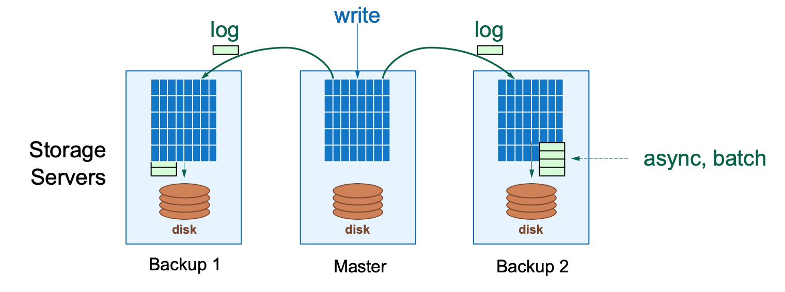
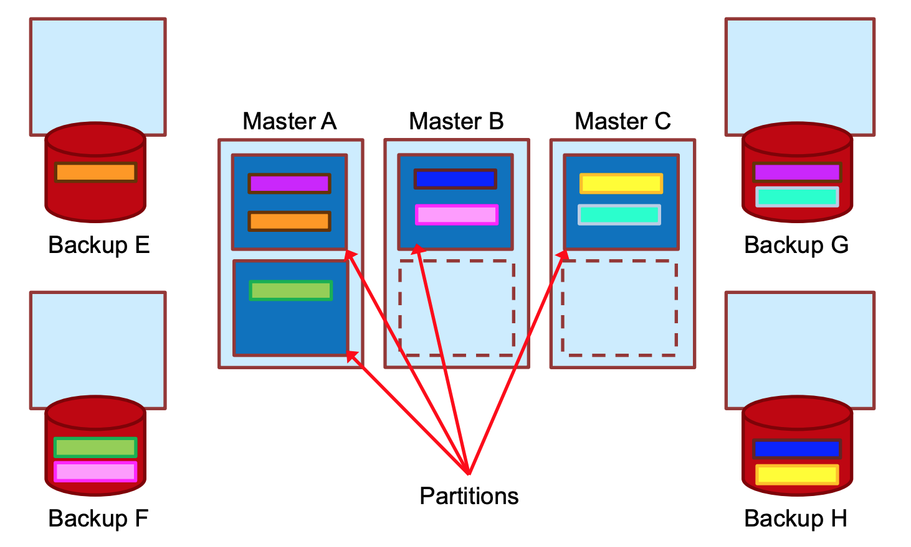
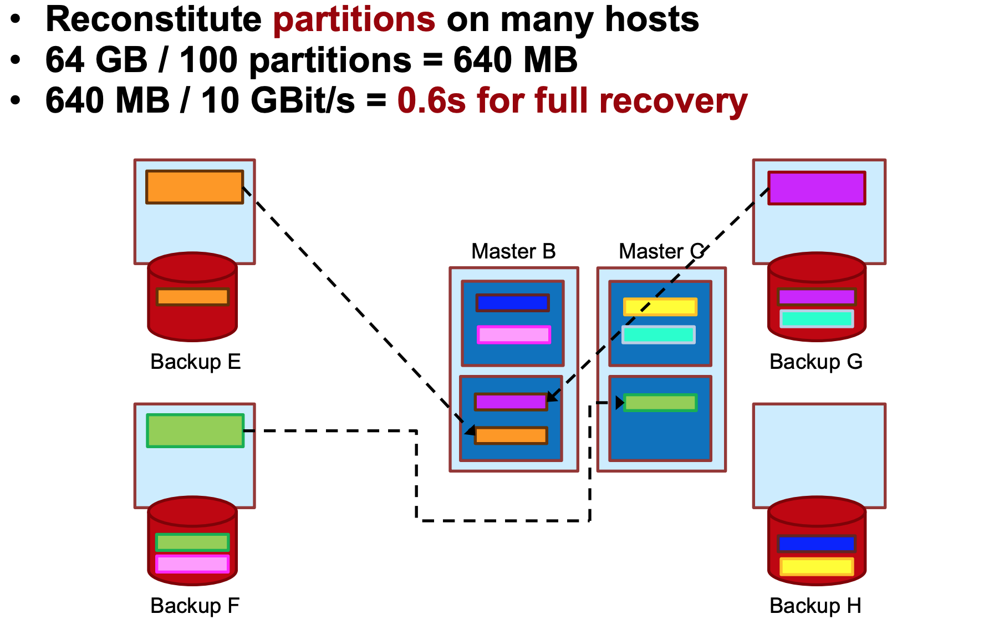

# RAMCloud

* [GitHub Notes](https://github.com/Emilio66/CSDI/blob/master/5_ramcloud_%E6%9D%8E%E7%84%B6.md)
* [RAMCloud：内存云存储的内存分配机制](https://blog.csdn.net/anzhsoft/article/details/21830991)
* [slides](../slides/lec3-RAMCloud.pdf)

## Motivation & Intro

DRAM常被用作数据的缓存，但是Cache miss和backing store overhead（备份存储器，就是Non-Volatile，非易失性存储器，断了电数据不会丢失的存储器）都让DRAM的潜能无法激发出来。因此论文作者设计了RAMCloud，它把所有的数据都置于DRAM中（这样不会出现Cache miss）。

RAMCloud将所有数据存放在DRAM中，性能可以达到比目前最高性能的硬盘存储系统还要高100～1000倍。在访问延迟方面，RAMCloud方案中运行在应用服务器中的一个进程从同一数据中心的存储服务器中通过网络读取数百字节数据只需5～10μs，而目前实际系统一般要花费0.5～10ms，具体取决于数据是在服务器内存缓存中，还是硬盘中。在可扩展性方面，关系型数据库无法扩展，RAMCloud使用了日志结构的数据存储使得扩展非常轻松。而且，一台多核存储服务器每秒可以服务至少100万次小读取请求。而硬盘系统中同样的机器每秒只能服务1000～10000次请求。

## RAMCloud Overview

架构图如下：

每个storage server都包含两个部分： Master和Backup。Master管理了存储在memory中的object。Backup使用本地的机械硬盘或者固态硬盘保存了其他server的数据备份。Coordinator管理了Master和Backup配置信息，比如集群各个server之间的关系和各个备份的分配。但是Coordinator并不涉入数据的读写操作，因此也不会成为cluster的bottleneck或者降低系统的scalability。

RAMCloud提供了一个简单的key-value的数据模型，**数据（称为object）都是连续存储的**。每个object都被长度不一的唯一的key标记。多个object被保存到table中，这个table有可能跨越多个server。object只能以整体的方式进行读写。它为小object做了专门的优化，这也非常适合超大规模的web并发的请求。

每个Master都有自己的日志，**数据是通过hash table关联日志的**。这些日志被分成8M的块，称为segment（段）。每个segment都会冗余到其他的server的Backup，典型的配置都是冗余2-3块。在client写操作的时候，冗余发送到其他的节点，这些节点在把冗余写到内存的buffer后就会返回，而不是保存到本地磁盘后才返回，这样保证了client的高速度写入。这些buffer在某些时间点会flush到本地存储。

RAMCloud的核心是提供 `durability & availability`

RAMCloud有以下几个特性：

- 利用scale: RAMCloud利用系统的大规模（large scale）来提供快速高效的错误恢复
- Log-structured storage: log-structured不仅用在了disk，也用在了DRAM。它为系统的提供了较高的性能
- Tablet profiling: 为了实现快速恢复，它帮助划分服务器的数据到partition中

RAMCloud 的数据模型是典型的key-value存储：在RAMCloud中，数据被已表(table)的方式组织起来，表内存储的是大量的对象(object)。

RAMCloud管理replica是通过——在中DRAM只保存每个object的一个备份，而大量的冗余备份是位于二级存储中的（如disk或flash）。但是这种方式备份会带来两个问题：

- 将数据放入disk，必须要同步地对disk写入——非常慢！
- 在宕机恢复的过程中，由于需要从二级存储读取数据来重构——还是慢！

既然把数据备份在二级存储中慢，那备份到DRAM中呢？这就需要DRAM不能断电，而且会产生高昂的费用！ 因此，RAMCloud还是选择把数据备份到二级存储中。为了解决这两个问题，RAMCloud采用了带 buffer 的log-structured的方式解决了disk写入慢的问题，而恢复慢的问题利用了scaling解决。

### Log-structured storage

RAMCloud的存储的过程是当一个master接收到写请求，它将要写入的object append到内存里的log中，然后再将log entry通过网络分发到各个backup去。backup将接收到的信息buffer到内存中，然后立即向master返回一个RPC请求，而不需要立即写入到disk。master接收到backup的请求之后，向client返回。对于backup，在buffer满了之后才将buffer的数据写入disk。

可是考虑到一点，log是被buffer到backup的DRAM中的，那么一旦断电，就会导致数据的丢失！为了解决这个问题，RAMCloud采用DIMM的方式，加入电池来保证buffer可以flush到disk上去。

注意到数据关联到日志使用的是 Hash table，hash table在RAMCloud是以<tableid, objectid>做key来定位内存中log的位置，在每次append log的时候，都会在hash table建立索引，hash table支持了对数据的随机访问。

那么log-structured logging有如下特点：

- 由于backup是采用buffering的方式存储log（这是异步的、批量化的），避免了对disk的同步写；
- 只有在backup的buffer满了之后，才将数据flush到disk上，这样做就不会浪费大量的时间在等待磁盘写入；
- log的结构是一致的，意思就是disk和DRAM的log结构一致，因此不需要额外的管理开销；
- 使用了hash table实现了数据的随机访问，高效。

综上，log-structure的实现解决了RAMCloud管理replica的策略带来的**disk写入慢**的问题，并且它有***优点***在于充分利用sequential I/O带宽（日志一开始也是存储在内存中的，它是连续存储的），避免了高延迟。而***缺点***在于，需要定期地对log进行cleaning操作，关于cleaning这一部分的技术细节还是很多的，但是[这篇文章](https://blog.csdn.net/anzhsoft/article/details/21830991)讲的很清楚了。

### Recovery

Recovery 是一个大话题，这里记录了最重要的using scaling。

#### Using Scaling

在论文中，最naive的想法就是一台机器宕机之后，立刻从多个backup读取信息重新构建crash的节点，每个backup并行的读取数据，如果backup的数目过少，磁盘带宽就成为了瓶颈。那么，在上文中提到，RAMCloud充分利用了scale来实现快速recovery，既然backup数目少会让磁盘带宽成为瓶颈，那么增加backup势必会减轻disk带来的瓶颈。增加backup的数量之后，大量的数据通过网络抵达master节点，然后master节点再来replay。这很好，一切并行，很快（约0.6秒）！但是收集所有的数据到新的节点上就会很慢！（约60s），此时因此网络和master的CPU性能成为瓶颈。

更好的想法是使用两阶段恢复，在一台机器挂了以后，会先找一台空机器：

* 一阶段：
  * 将所有数据读入备份的内存中；
  * 只向新的Master传送位置信息。
* 二阶段：
  * server发送请求时，直接根据地址就可以找到备份的数据；
  * 在server请求之间，备份传输数据，直到全部传完，就又和原来表现一致了。

这种想法试图让新节点恢复到和之前一样，但首先它需要和所有备份持续通信；其次它没有处理异质性，节点成了恢复单元；并且一定要准备好一个空节点池。

RAMCloud采用了`Partitioned Recovery`策略，来进行错误恢复。思路也很简单，既然我存的都只是key/value，那我完全没必要在一台机器上重现嘛，完全可以恢复到多台机器上。RAMCloud将crashed master的object分割到若干recovery master上，让它们分开处理。并且，这些recovery master把这些数据整合到自己的log和hash table中。这样就解决了CPU/disk/network对性能带来的瓶颈，它的核心方法就是利用了系统的scaling。而这种方法的缺点就是需要与所有的host进行通信。

通过下面三张图对这种方法有一个更直观的了解：

对scaling的总结：

- 利用scale去获得高可用性，分散写来克服disk的bottleneck，分散rebuilding来克服CPU和网络的bottleneck
- Scale驱使了更低的latency我