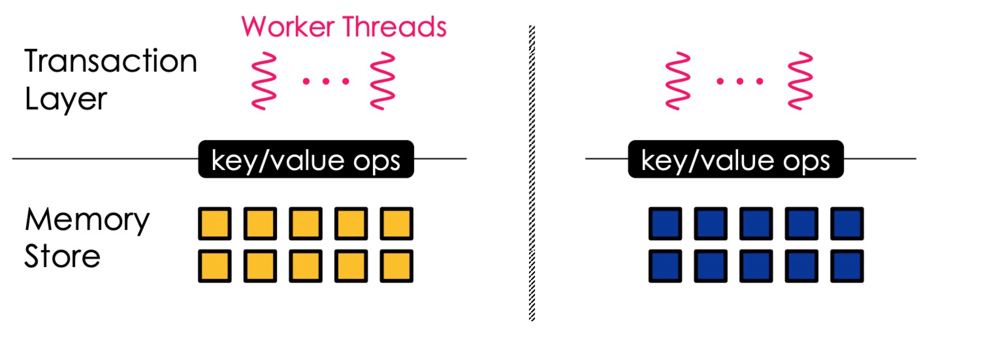

# DrTM 

* [GitHub Notes](https://github.com/Emilio66/CSDI/blob/master/14-RDMA-%E5%90%B4%E5%BC%BA%E5%BC%BA.md)

## Motivation

- 数据库领域
  - 内存数据库的兴起
  - 传统事务为实现ACID的代价(Logging/Locking/...)
  - 分布式事务的梦魇(分布式锁要比本地锁慢好几个数量级, 加锁时间越长, 并发程度越低, 延迟越高)
- 硬件领域
  - HTM（Hardware Transaction Memory）：HTM在硬件层面提供了**强原子性**支持。HTM的目的是能够支持在内存中原子的进行多地址写入，以避免与其他合作线程产生不一致的情况（非事务性代码将在其访问冲突时无条件地中止事务）。
    - 限制
      - HTM内不能有IO
      - HTM不保证一定成功, 需要fallback
  - RDMA: 提供了**强一致性**的远程访问支持。比如，单向RDMA操作与本地访问缓存一致。
    - 注意, 这里的一致性是内存层面的一致性, 当作Coherence来理解
    - 三种接口
      - 模拟TCP/IP：~100us
      - recv/send：~7us
      - 单向访问：最快, ~3us级(原生TCP/IP大约是500us)
        - RDMA CAS有多种级别. 在论文所有的机器上, RDMA CAS与Local CAS **不兼容**

## DrTM

HTM的强原子性和RDMA的强一致性为分布式事务内存带来机遇。

论文实现了一个 **分布式** **内存数据库**，DrTM（Fast In-memory Transaction Processing using RDMA and HTM）。它使用了HTM的ACI（没有D）的特性来处理本地的Tx 执行，使用单向的RDMA来处理多HTM事务的执行，减少了系统latch和lock处理花费的时间。

论文实现可以分成两层:

- 事务层: 处理事务, 所有并发控制在这一层做
- 存储层: 处理存储, 不考虑并发控制, 从而使得逻辑更加清晰, 并且实现更加简洁

## Transaction Layer

基本思想是做 HTM (本地) + Locking (远程) 来实现事务 (ACI)，D 由 Logging + UPS (断电时将内存刷回持久化存储)来保证。

- 使用Transaction Chopping的技术将大的事务切分为小事务, 保证能够在HTM内执行
- 读写事务与只读事务的分别对待
  - 由于只读事务通常需要读取很多内容, 容易造成HTM失效, 因此, DrTM将两者区别对待
- 分布式事务的处理
  - 思路: 将远程机器上的内存读到本地来, 从而转化为单机事务(用HTM解决)
- HTM失效时Fallback的处理

### Challenge of HTM

* 当事务在同一台机器上, HTM能保证原子性，但它对于分布式事务来说没有任何作用；
* RDMA的指令会无条件的 abort 目标机器冲突的 HTM 事务，这就意味着我们无法通过HTM事务中的RDMA直接访问远程记录。

为此，DrTM使用**2PL**在HTM事务中实际执行之前将所有远程记录安全地累积到本地缓存中，直到本地提交HTM事务将本地的更新写回到其他机器。

DrTM提供严格的可序列化事务，它们分为三个阶段：Start，LocalTX和Commit。 在Start阶段，事务会事先锁定并预取所需的远程数据，然后运行XBEGIN以启动HTM事务。 在LocalTX阶段，HTM事务为所有本地记录提供事务读取和写入。 在提交阶段，分布式事务首先使用XEND提交HTM事务，然后更新和解锁所有远程记录。

**2PL上的锁是一种软件层面的锁**，在b这种情况下，如果M2正在执行事务，HTM由于收到RDMA read 就被直接 abort 了，这没有问题。但是不幸的是，如果本地访问发生的时间晚于远程访问，则冲突的本地事务将错误地提交。为此，DrTM进一步检查HTM事务的本地读写操作内的记录状态，并在检测到冲突时显式中止HTM事务。

### Lock

当事务在在多台机器上, 需要用锁来保证（2PL可以提供Serializability）。

- 写锁: 保证唯一访问
- 读锁: 基于Lease的共享锁
  - Synchroinzed Time提供分布式的时间服务
  - 验证锁是否Expired: now > lease_end_time + DELTA
  - 验证锁是否可用: now < lease_end_time - DELTA
  - (..., lease_end_time - DELTA): 当前时间在此范围内, 表示仍然持有读锁
  - [lease_end_time - DELTA, lease_end_time + DELTA], 此为误差范围, 必须避开它
  - (lease_end_time + DELTA, ...): 当前时间在此范围内, 表示已经过期
- 实现: RDMA CAS

### Read-only Txn

只读事务是一种特殊情况，通常具有非常大的读取集，涉及多达数百甚至数千条记录。 因此，它可能会中止HTM 事务。 为了解决这个问题，DrTM提供了一个单独的方案来执行无HTM的只读事务。本地事务需要使用CAS来加锁，本地CAS和RDMA CAS 冲突，因此，统一使用 RDMA CAS。

### Read-write Txn

- 思路:
  - 对于read_set与write_set, 判断是否在都在本地, 如果不是, 则有RDMA加锁并读取(加锁之后, 其他事务就无法访问它们了)
    - end-time = minimum(endtime of lock(x) for x in read_set): 取最小的lease time
  - 涉及到的数据都到了本地后, 使用HTM进行事务处理
  - 事务提交前, 检查now < end-time - DELTA, 如果为真, 说明所有的读锁都没有过期, 事务可以提交, 否则abort
  - 事务提交后, 将write_set加的数据写回, 并释放写锁, 读锁会自动过期
- 读写事务冲突检测:
  - 先本地/再本地: 由HTM保证原子性
  - 先本地/再远程: 远程的RDMA请求, 会打断当前机器的HTM. 当前事务, 只能等待远程RDMA加的写锁释放后再继续进行. 如果远程RDMA加的是读锁, 则本地HTM可以同时执行
  - 先远程/再本地: 远程的RDMA会先加锁数据, 本地HTM要去访问时, 如果发现数据上有写锁, 则abort, 如果有读锁, 则可并行执行
  - 先远程/再远程: 远程的RDMA会先加锁数据, 另一个远程RDMA来访问时, 如果发现已经有写锁, 则中止, 如果发现是读锁, 则取其中止时间为自己锁的中止时间, 然后正常执行
- Fallback实现
  - HTM不保证一定可以成功, 即使没有冲突, 因此, 需要一个fallback(基于锁)
  - 步骤
    - 放锁
    - 对所有锁排序后重新加锁, 以避免死锁
    - 执行操作
    - 放锁
    - 写回
  - 注意: 以上操作需要记Log, 以应对错误情况

### Key points

- 冲突检测
  - 对于同样使用了HTM的两个事务，HTM保证它们的before-or-after；
  - 对于一个已经存在的HTM事务(读ab, 写cd)，如果另一个远程事务需要访问abcd，则需要先用RDMA加锁，并把数据读回来，加锁过程会abort已有的HTM事务，从而后面的这个远程事务会先发生. 之前的HTM事务需要重试；
  - 对于两个远程事务，锁会保证其先后；
  - 所有只读事务都当作远程事务来处理(使用加锁来保证顺序)；
- HTM + 读写锁机制等价于2PL, 从而, 可以保证Serializability
  - 使用HTM完成的事务与使用2PL完成的事务是等价的.
    - 在HTM中, 如果两个事务冲突, 且其中至少一个为写, 则HTM保证abort掉其中一个, 从而保证了顺序；
    - 在HTM中, 如果两个事务冲突, 且其中一个涉及到了远程对象, 且加锁机制可以保证两个事务的顺序。
  - DrTM中的基于Lease的读锁和传统的shared read lock是等价的
    - 在DrTM中, 如果机器A对x加了读锁, 则机器B可以共享此读锁.
    - 当事务执行完毕, DrTM会检测所有读锁是否过期, 如果已经过期, 事务不会commit, 没有影响. 如果没有过期, 则提交. 这等价于2PL中, 所以锁在 `Shrink` 阶段提交, 并且不会加新的锁.
  - DrTM中, 所以锁都会在 `Shrink` 阶段提交, 等价于2PL中的行为
    - HTM执行完毕后, 所有本地'锁'都会被释放.
    - 在HTM的confirmation阶段, 即检测读锁是否过期, 检测通过, 则先行于所有锁释放, 且不会再拿新的锁.
    - 在所有HTM事务提交后, 写锁最终都被会释放.

## Memory Storage

DrTM的内存存储层为上层事务层提供了一般的 key value 存储接口。此接口的最常见用法是按给定键读取或写入记录。 为了优化不同的访问模式，DrTM提供了B +树形式的有序存储和散列表形式的无序存储。DrTM提供了两类存储：

- 有序存储：基于B+ Tree，没有充分利用RDMA的特性；
- 无序存储：基于Hash，充分利用了RDMA的特性，并且在事务层的保护下，不需要考虑冲突检测问题。

DrTM利用HTM强大的原子性和RDMA的强一致性来设计HTM / RDMA友好的哈希表。首先，DrTM通过利用HTM的强原子性将竞争检测与hash table分离，其中键值对上的所有本地操作（例如，READ / WRITE / INSERT / DELETE）都受到HTM事务的保护，因此任何冲突的访问都将中止HTM交易。这显着简化了 race detection 的数据结构和操作。其次，DrTM使用单向 RDMA 操作对远程键值对执行 READ 和 WRITE，而不涉及主机。最后，DrTM将键和值及其对应元数据分离到一个**解耦**的内存区域，从而产生两级查找。这使得利用单向 RDMA READ 进行查找变得高效，因为一个 RDMA READ 可以获取key的cluster。此外，分离的键值对可以实现RDMA友好，基于位置和主机透明的缓存。

- 无序存储实现

  

- 有序存储实现

  - 只需要知道它没有充分利用RDMA特性, 是个future work就是了

- 其他: 论文中比较了DrTM与其他另外两个平台的Hash实现，DrTM的优点大概是

  - 分离了存储操作与冲突检测
  - 之前的实现偏向于RDMA(而不是Local), 增加了延迟
  - 本地内存操作还是比RDMA快, 但是之前的实现没有考虑本地缓存。

## Disadvantage

- 事务需要事先知道write-set与read-set
- 无序存储是HTM/RDMA友好的, 而有序存储则没有对RDMA做过优化
- 当有机器失效时, 考虑Durability而不是可用性
  - 读写事务提交后, 需要写回, 并释放写锁, 如果此时, 此机器挂了, 其锁永远无法被释放