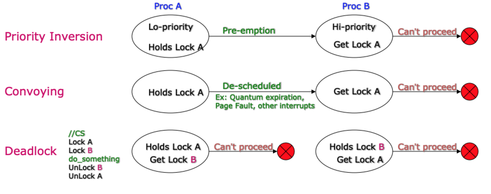

# Transaction Memory

* [GitHub notes](https://github.com/Emilio66/CSDI/blob/master/8_TransactionalMemory_%E6%9D%8E%E9%98%B3%E5%BE%B7.md)
* [Extend slides](../slides/lec5-extend.ppt)

多核处理器越来越普及，如何利用硬件性能，更加高效的提升并行程序的性能成为难点。基于锁的同步机制存在以下问题：

- 粗粒度的锁虽然易于使用，但是性能低下，锁竞争频繁，无关的操作会出现顺序执行的情况；
- 细粒度的锁虽然性能高，但是实现难度大，例如双端队列的并行版本使用细粒度的锁难以实现；
- 存在优先级反转（priority inversion）、护航（conveying）、死锁（dead lock）等问题：
  - *优先级反转* 一个高优先级任务间接被一个低优先级任务所抢先(preemtped)，使得两个任务的相对优先级被倒置
  - *护航* 多线程程序中相同优先级任务反复竞争同一个锁。当一个持有锁的进程被解调度了，可能是因为调度时间到了，发生了一个页错误，或者是其他一些终端。当有类似终端发生时，其他本该可以运行的进程却无法运行。
  - *死锁* 两个或以上任务在执行过程中，由于竞争资源造成阻塞

如下图：



## Solution

新的同步机制==> **无锁算法**、**无锁的数据机构**

参考数据库系统中的事务的概念，引入事务的ACID概念。本篇论文介绍事务性内存--一种新的多核架构，使用无锁的同步机制并使其与传统锁机制下达到同样的性能并保持简单。

可以使用软件来模拟事务执行，也可以使用硬件来加速支持（硬件更加可靠？）

- STM: Software Transactional Memory
- HTM: Hardware Transactional Memory

intel Haswell 使用了Restricted Transactional Memory (RTM)，一种受限制的硬件事务内存实现。新增了三个 指令如下所示,但是work set是受限的，一些System event废弃了TX

```
Xbegin
Xend
Xabort
```

## Detailes

事务是有限的机器指令序列，被单个进程所执行，并满足有序性和原子两个特性。有序性意味着一个事务执行的步骤不会和另一个事务相交错。原子性指每个事务都会暂时的修改共享内存，当一个事务完成后，要么commit，使修改对其他进程可见；要么abort，废弃自己的修改，不存在其他的中间状态。

**访问内存的基本指令**

```
Load-transactional LT //从共享内存出读取值到私有寄存器

Load-transactional exclusive LTX // 从共享内存出读取值到私有寄存器并标记 即将更新

Store-transactional ST //将私有寄存器中的值写入共享内存中（write set），尚不对外可见
```

一个事务的read set（⚠️注意是set）是指被LT指令读取的位置，它的write set指被 LTX 或者 ST 指令访问的位置。read和write组成了事务的data set.

**修改状态的基本指令**

```
Commit(COMMIT) //尝试使事务所做的修改持久化,其他事务不再更新本事务的data set，没有别的事务读取过本事务的write set，即commit成功，并使该事务对于write set所做的修改对别的事务可见。

Abort(ABORT)   // 取消所有对于write set的临时修改。

Validate(VALIDATE) // 测试当前事务的状态，返回true说明当前还没有abort执行，返回false说明当前事务已经被abort
```

通过对以上指令的组合和使用，开发者可以实现自己的一套read-modify-write操作。本文所实现的transacnal memory访问指令与原有的指令并不冲突，也兼容原有的 `LOAD`、`STORE`指令。

具体执行流程

[](https://github.com/Emilio66/CSDI/blob/master/img/8_1.png)

1. 使用`LT`或者`LTX`指令从共享内存中读取数据
2. 使用`VALIDATE`指令确认读取数据的有效性
3. 使用`ST`指令来修改共享内存中的数据
4. 使用`COMMIT`指令使修改生效；如果`VALIDATE`或者`COMMIT`失败，返回步骤1

本论文基于多核缓存一致性协议进行了扩展，实现对事务性内存的支持。具体的协议包括：

- 共享总线（Snoopy cache）
- 基于目录（directory）

两种结构的支持。任何具有冲突访问检测能力的协议都可以用来检测事务冲突，不需要带来额外的开销。所以本文的实现直接复用了原有的协议。

>  下面以共享总线结构的协议为例:

**缓存**

为了最小化对非事务性内存指令影响，每个处理器持有两种cache：

- regular cache （非事务性内存）
- transactional cache (事务性内存)

这两种cache是互斥的，一次访问只可能访问一种cache，而且这两种cache都是一级cache或者二级cache，可以被处理器直接访问。regular cache是传统的直接映射cache；transactional cache空间较小，完全相连的由额外的逻辑来实现事务的提交和废弃。事务cache存储所有临时写的副本，除非事务提交，否则缓存内容将不会传给其他处理器或内存。

遵循`Goodman`大神的指示，每个cache行的状态如下表所示

| Name     | Access | Shared? | Modified? |
| -------- | ------ | ------- | --------- |
| INVALID  | none   |         |           |
| VALID    | R      | Yes     | Yes       |
| DIRTY    | R,W    | No      | Yes       |
| RESERVED | R,W    | No      | No        |

但是这些状态不够描述事务性内存访问，所以我们扩充了一些状态来描述事务内存的执行状态

| Name    | Meaning                  |
| ------- | ------------------------ |
| EMPTY   | 表示这里的数据没用了     |
| NORMAL  | 这是一个已经commit的数据 |
| XCOMMIT | 旧数据                   |
| XABORT  | 新数据（还未提交）       |

事务性操作缓存有两个标志位，分别为`XCOMMIT`，`XABORT`。当事务提交时，会将`XCOMMIT`标记为`EMPTY`，将`XABORT`标记为`NORMAL`；当事务废弃时，会将`XABORT`标记为`EMPTY`，`XCOMMIT`标记为`NORMAL` 当事务性缓存需要空间时，首先搜索被标记为`EMPTY`的位置，之后再搜索被标记为`NORMAL`的位置，最后才是`XCOMMIT`的位置，由此来确定优先级，并且避免访问竞争资源提升性能，如下图：


**总线**

除了缓存状态，对于共享总线结构的协议来说，还有总线周期，具体见下表

| Name   | Kind    | Meaning       | New access |
| ------ | ------- | ------------- | ---------- |
| READ   | regular | read value    | shared     |
| RFO    | regular | read value    | exclusive  |
| WRITE  | both    | write back    | exclusive  |
| T_READ | trans   | read value    | shared     |
| T_RFO  | trans   | read value    | exclusive  |
| BUSY   | trans   | refuse access | unchanged  |

以上的cycle中前三个是`Goodman`大大协议总已经定义过了的，本文扩展了三个周期，`T_READ`、`T_RFO`和`BUSY`，前两个就是对原有周期的简单扩展，`BUSY`周期是为了防止各个transation之间过于频繁的互相abort而设立的，当事务接收到BUSY回应后，会立即abort并retry，理论上防止了资源饥饿。

**处理器**

每个处理器持有两个状态标识位：

```
TACTIVE(transaction active)//是否有事务在运行
TSTATUS(transaction status)//事务是否是active还是aborted
```

> **注**：`TACTIVE`标识会在事务在执行第一次事务操作时被隐式（偷偷地）设定。

一个被标记为`TSTATUS`为TRUE的事务LT指令的具体操作流程：

1. 探测事务缓存中的`XABORT`入口，如果有则返回值
2. 如果没有但是有`NORMAL`入口，将`NORMAL`改为`XABORT`入口，使用相同的标记`XCOMMIT`和相同的数据再分配一个入口
3. 如果没有`XABORT`或`NORMAL`入口，进入`T_READ`周期，如果成功，我们会设置两个事务性内存的入口：`XCOMMIT`、`XABORT`。每个都满足之前的协议，并进入到`READ`周期
4. 如果收到`BUSY`信号，则abort事务

对于LTX指令，我们使用T_RFO周期取代T_READ，如果上一周期成功就将cache line的状态标记为RESERVED。ST指令类似LTX，只是更新了XABORT入口的数据。cache line的标记，LT、LTX指令类似LOAD，ST类似STORE。VALIDATE指令返回TSTATUS状态，如果返回false，则将TACTIVE标志指定为false，并将TSTATUS指定为ture。ABORT指令会忽略cache入口，将TSTATUS置为true，TACTIVE置为false。COMMIT指令会返回TSTATUS，设置TSTATUS为true，TACTIVE为false，放弃所有的XCOMMIT缓存入口，并将所有XABORT标志变为NORMAL。最后，遇到终端和缓存溢出则会abort当前事务，如下图：


这里`TSTATUS`的作用还是没法很好的理解，等待后续补充了……

