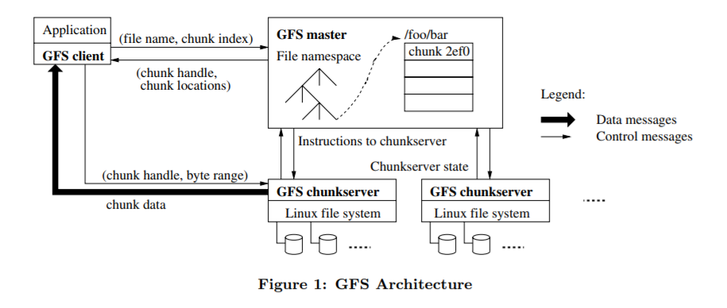
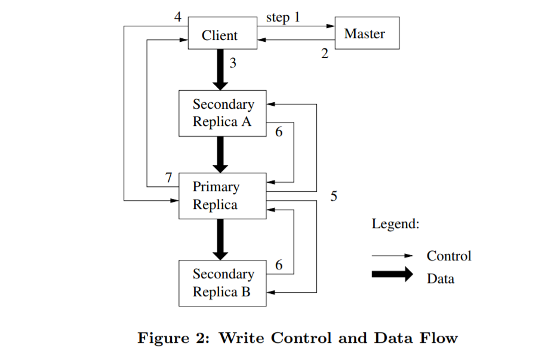

# The Google File System

* [The Google File System](https://static.googleusercontent.com/media/research.google.com/zh-CN//archive/gfs-sosp2003.pdf)

The Google File System，简称GFS，Google三大马车之一。是分布式文件系统领域划时代意义的论文，文中的多副本机制、控制流与数据流隔离和追加写模式等概念几乎成为了分布式文件系统领域的标准，Apache Hadoop鼎鼎大名的HDFS就是GFS的模仿之作。因此，关于GFS内容的介绍还是很多的，几篇关于这篇文章的翻译质量都挺高的，我主要看的是[这一篇](http://www.importnew.com/3491.html)。

**概括Google File System，它是一个可扩展的分布式文件系统，用于大型的、分布式的、对大量数据进行访问的应用。它运行于廉价的普通硬件上，提供容错功能。从根本上说：文件被分割成很多块，使用冗余的方式储存于商用机器集群上。**

## GFS的体系结构：



* 一个GFS包含单个Master和多个chunkserver，被多个客户端访问，上图各组件都是某台普通Linux机器上运行在**用户级别**的一个进程；
* 文件被划分为固定大小的chunk。每个chunk在创建时会被分配一个chunk句柄，chunk句柄是一个不变的、全局唯一的64位的ID。chunkserver在本地磁盘上将chunk存储为Linux文件，按照chunk句柄和字节范围来读写chunk数据。为了可靠性，**每个chunk被复制到多个chunkserver上**，默认是3份，用户能为不同命名空间的文件配置不同的复制级别；
* master维护所有的文件系统元数据。包括命名空间，访问控制信息，从文件到chunk的映射，和chunk位置。它也负责主导一些影响整个系统的活动，比如chunk租赁管理、孤儿chunk的垃圾回收，以及chunkserver之间的chunk迁移。master会周期性的与每台chunkserver通讯，使用心跳消息，以发号施令或者收集chunkserver状态；
* 每个应用程序会引用GFS的客户端API，负责与master和chunkserver通讯，基于应用的行为来读写数据。**客户端只在获取元数据时与master交互，真实的数据操作会直接发至chunkserver**；
* **客户端和chunkserver都不会缓存文件数据**。大部分应用通常会顺序扫描大型文件，缓存重用率不高，要么就是工作集合太大缓存很困难。没有缓存简化了客户端和整个系统，排除缓存一致性问题（一致性是分布式系统中的一个最重要的问题，但是客户端会缓存元数据）。chunkserver不需要缓存文件数据因为chunk被存储为本地文件，Linux提供的OS层面的buffer缓存已经保存了频繁访问的文件。

### 单一Master

GFS的单一master大大的简化了设计，单一master能够放心使用全局策略执行复杂的chunk布置、制定复制决策等。然而，为了不让master成为一个瓶颈，在读写过程中尽量减少对它的依赖。客户端从不通过master读写文件，它只会询问master自己应该访问哪个chunkserver。**客户端会缓存这个信息一段时间，随后的很多操作即可以复用此缓存，与chunkserver直接交互。**

首先，使用固定的chunk size，客户端将应用程序指定的文件名和字节偏移量翻译为一个GFS文件及内部chunk序号，随后将它们作为参数，发送请求到master。master找到对应的chunk句柄和副本位置，回复给客户端。客户端缓存这些信息，使用GFS文件名+chunk序号作为key。

客户端然后发送一个读请求到其中一个副本，很可能是最近的那个。请求中指定了chunk句柄以及在此chunk中读取的字节范围。后面对相同chunk的读不再与master交互，直到客户端缓存信息过期或者文件被重新打开。事实上，客户端通常会在一个与master的请求中顺带多索要一些其他chunk的信息，而且master也可能将客户端索要chunk后面紧跟的其他chunk信息主动回复回去。这些额外的信息避免了未来可能发生的一些client-master交互，几乎不会导致额外的花费。

### chunk size

chunk size是其中一个关键的设计参数。GFS选择了64MB，这比当时典型的文件系统的块大多了。每个chunk副本在chunkserver上被存储为一个普通的Linux文件，只在必要的时候才去扩展。Lazy的空间分配避免了内部碎片导致的空间浪费，因为chunk size越大，碎片的威胁就越大。

chunk size较大时可以提供几种重要的优势：

* 它减少了客户端与master的交互，因为对同一个chunk的读写仅需要对master执行一次初始请求以获取chunk位置信息。在我们的应用场景中大部分应用会顺序的读写大型文件，chunk size较大chunk数量就较少，这能有效的降低与master的交互次数。对于小型的随机读，即使整个数据集合达到TB级别，客户端也能舒服的缓存所有的chunk位置信息（因为chunk size大，chunk数量小，每一个chunk上可能有多个随机读的位置）；
* 既然用户面对的是较大的chunk，它更可能愿意在同一个大chunk上执行很多的操作（而不是操作非常多的小chunk），这样就可以对同一个chunkserver保持长期的TCP连接以降低网络负载；
* 它减少了master上元数据的大小，这允许我们GFS的在内存缓存元数据。

不过chunk size如果很大，即使使用懒惰的空间分配，也有它的缺点。在chunkserver上这些chunk可能变成热点，因为很多客户端会访问相同的文件（如果chunk size较小，那小文件也会包含很多chunk，资源竞争可以分担到各个小chunk上，就可以缓解热点）。GFS最初被用在批量队列系统时，用户将一个可执行程序写入GFS，它只占一个chunk，然后几百台机器同时启动，请求此可执行程序，那么存储此可执行文件的chunkserver在过多的并发请求下负载较重。可以通过提高它的复制级别解决了这个问题（更多冗余，分担压力），并且建议该系统交错安排启动时间。一个潜在的长期解决方案是允许客户端从其他客户端读取数据。

### 元数据

master主要存储三种类型的元数据：文件和chunk的命名空间，从文件到chunk的映射，每个chunk副本的位置。所有的元数据被保存在master的内存中。使用操作日志允许我们更简单可靠的更新master状态，不会因为master的当机导致数据不一致。前两种会持久化保存，但master不会持久化存储chunk位置，相反，master会在启动时询问每个chunkserver以获取它们各自的chunk位置信息，新chunkserver加入集群时也是如此。

因为元数据存储在内存中，master可以很快执行元数据操作。而且可以简单高效的在后台周期性扫描整个元数据状态。周期性的扫描作用很多，有些用于实现chunk垃圾回收，有些用于chunkserver故障导致的重新复制，以及为了均衡各机器负载与磁盘使用率而执行的chunk迁移。

> 这么依赖内存不免让人有些顾虑，随着chunk的数量和今后整体容量的增长，整个系统将受限于master有多少内存，实验结果表明内存大小并不是严重的问题。如果整个文件系统真的扩展到非常大的规模，给master添点内存条、换台好机器scale up一下也是值得的。为了单一master+内存中数据结构所带来的简化、可靠性、性能和弹性，豁出去了。

操作日志是对重要元数据变更的历史记录。它是GFS的核心之一。不仅因为它是元数据唯一的持久化记录，而且它还要承担一个逻辑上的时间标准，为并发的操作定义顺序。各文件、chunk、以及它们的版本，都会根据它们创建时的逻辑时间被唯一的、永恒的标识。

既然操作日志这么重要，必须可靠的存储它，而且直至元数据更新被持久化完成（记录操作日志）之后，才能让变化对客户端可见。否则，有可能失去整个文件系统或者最近的客户端操作，即使chunkserver没有任何问题（元数据丢了或错了，chunkserver没问题也变得有问题了）。因此，将操作日志复制到多个远程机器，直到日志记录被flush到本地磁盘以及远程机器之后才会回复客户端。master会捆绑多个日志记录，一起flush，以减少flush和复制对整个系统吞吐量的冲击。

master可以通过重放操作日志来恢复它的元数据状态。为了最小化master的启动时间，日志不能太多（多了重放就需要很久）。所以master会在适当的时候执行“存档”，每当日志增长超过一个特定的大小就会执行存档。所以它不需要从零开始回放日志，仅需要从本地磁盘装载最近的存档，并回放存档之后发生的有限数量的日志。

### 一致性模型

GFS松弛的一致性模型能很好的支持我们高度分布式的应用，而且实现起来非常简单高效。我们现在讨论GFS的一致性保证。

文件命名空间变化（比如文件创建）是原子的，只有master能处理此种操作：master中提供了命名空间的锁机制，保证了原子性的和正确性；master的操作日志为这些操作定义了一个全局统一的顺序


高度分布式应用最大的一个问题是一致性问题，各种数据变异在不断发生，被它们改变的文件区域处于什么状态？这取决于变异是否成功了、有没有并发变异等各种因素。上表列出了所有可能的结果对于文件区域A，

* 如果所有客户端从任何副本上读到的数据都是相同的，那A就是一致的；
* 如果A是一致的，并且客户端可以看到变异写入的完整数据，那A就是defined；
* 当一个变异成功了、没有受到并发写的干扰，它写入的区域将会是defined且一致的：所有客户端都能看到这个变异写入的完整数据；
* 对同个区域的多个并发变异成功写入，此区域是一致的，但可能是undefined：所有客户端看到相同的数据，但是它可能不会反应任何一个变异写的东西，可能是多个变异混杂的碎片；
* 一个失败的变异导致区域不一致且undefined：不同客户端可能看到不同的数据在不同的副本。

下面描述我们的应用程序如何区分defined区域和undefined区域。

数据变异可能是写操作或者record append。写操作导致数据被写入一个用户指定的文件偏移。而record append导致数据（record）被原子的写入GFS选择的某个偏移，GFS选择的偏移被返回给客户端，其代表了此record所在的defined区域的起始偏移量。另外，某些异常情况可能会导致GFS在区域之间插入了padding或者重复的record。他们占据的区域可认为是不一致的，不过数据量不大。

如果一系列变异都成功写入了，GFS保证发生变异的文件区域是defined的，并完整的包含最后一个变异。GFS通过两点来实现：(a)chunk的所有副本按相同的顺序来实施变异；(b)使用chunk版本数来侦测任何旧副本，副本变旧可能是因为它发生过故障、错过了变异。执行变异过程时将跳过旧的副本，客户端调用master获取chunk位置时也不会返回旧副本。GFS会尽早的通过垃圾回收处理掉旧的副本。

因为客户端缓存了chunk位置，所以它们可能向旧副本发起读请求。不过缓存项有超时机制，文件重新打开时也会更新。而且，大部分的文件是append-only的，这种情况下旧副本最坏只是无法返回一部分数据（append-only意味着只增不减也不改，版本旧只意味着会丢数据、少数据），而不会返回过期的、错误的数据。一旦客户端与master联系，它将立刻得到最新的chunk位置（不包含旧副本）。

在一个变异成功写入很久之后，组件的故障仍然可能腐化、破坏数据。GFS中，master和所有chunkserver之间会持续握手通讯并交换信息，借此master可以识别故障的chunkserver并且通过检查checksum侦测数据腐化。一旦发现此问题，会尽快执行一个restore，从合法的副本复制合法数据替代腐化副本。

> 延申：一致性的问题介绍起来难免晦涩枯燥，下面用一些比较浅显的例子来解释GFS中的一致、不一致、defined、undefined四种状态。
>
> 可以想象这样一个场景，某人和他老婆共用同一个Facebook账号，同时登陆，同时看到某张照片，他希望将其顺时针旋转90度，他老婆希望将其逆时针旋转90度。两人同时点了修改按钮，Facebook应该听谁的？俗话说意见相同听老公的，意见不同听老婆的。但是Facebook不懂这个算法，当他们重新打开页面时可能会：1 都看到图片顺时针旋转了90度；2 都看到图片逆时针旋转了90度；3 其他情况。对于1、2两种情况，都是可以接受的，小夫妻若来投诉那只能如实相告让他们自己回去猜拳，不关Facebook的事儿。因为1、2既满足一致性（两人在并发修改发生后都一直看到一致相同的内容），又满足defined（内容是其中一人写入的完整数据）。对于3会有哪些其他情况呢？如果这事儿发生在单台电脑的本地硬盘（相当于两人同时打开一个图片软件、编辑同一个图片、然后并发提交保存），若不加锁让其串行，则可能导致数据碎片，以简单的代码为例：
>
> ```
> File file = new File("D:/temp.txt");
> FileOutputStream fos1 = new FileOutputStream(file);
> FileOutputStream fos2 = new FileOutputStream(file);
> fos1.write('1');
> fos1.write('2');
> fos1.write('3');
> fos2.write('a');
> fos2.write('b');
> fos2.write('c');
> fos1.close();
> fos2.close();
> ```
>
> 这样一段代码可以保证temp.txt的内容是“abc”（fos2写入的字节流完全覆盖了fos1），fos2写入是完全的，也就是defined。而写入字节流是一个持续过程，不是原子的，如果在多线程环境下则可能因为线程调度、I/O中断等因素导致代码的执行顺序交错，形成这样的效果：
>
> ```
> File file = new File("D:/temp.txt");
> FileOutputStream fos1 = new FileOutputStream(file);
> FileOutputStream fos2 = new FileOutputStream(file);
> fos1.write('1');
> fos2.write('a');
> fos2.write('b');
> fos1.write('2');
> fos1.write('3');
> fos2.write('c');
> fos1.close();
> fos2.close();
> ```
>
> 这段代码导致temp.txt的内容变成了“a2c”，它不是fos1的写入也不是fos2的写入，它是碎片的组合，这就是undefined状态。还有更糟的情况，这种情况在单台电脑本地硬盘不会出现，而会在分布式文件系统上出现：分布式文件系统都有冗余备份，fos1和fos2的写入需要在每个副本上都执行，而在每个副本上会因为各自的线程调度、I/O中断导致交错的情况不一、顺序不一，于是出现了副本数据不一致的情况（不仅有a2c，还可能是12c、1b3等等），在查询时由于会随机选择副本，于是导致多个查询可能看到各种不一致的数据。这就是既不一致又undefined的情况。在分布式文件系统上还有另一种情况，在各副本上fos1和fos2都没有交错产生碎片，但是它们整体顺序不一致，一个副本产出了123，另一个产出了abc，这种也是不一致的异常情况。
>
> 如何解决上述问题呢？比较可行的方案就是串行化，按顺序执行，fos1写完了才轮到fos2。不过即使如此也不能完全避免一些令人不悦的现象：比如fos1要写入的是“12345”，fos2要写入的是“abc”，即使串行，最后也会产出“abc45”。不过对于这种现象，只能认为是外界需求使然，不是文件系统能解决的，GFS也不会把它当做碎片，而认为它是defined。在分布式环境下，不仅要保证每个副本串行执行变异，还要保证串行的顺序是一致的，GFS的对策就是后文中的租赁机制。这样还不够，还要谨防某个副本因为机器故障而执行异常，GFS的对策是版本侦测机制，利用版本侦测踢除异常的副本。

在使用GFS时，应用如果希望达到良好的一致性效果，需要稍作考虑以配合GFS的松弛一致性模型。但GFS的要求并不高，而且它要求的事情一般你都会去做（为了某些其他的目的）：比如GFS希望应用使用append写而不是覆盖重写，以及一些自我检查、鉴定和验证的能力。

无论面对GFS还是普通的本地文件API，有些一致性问题都要去考虑。当一个文件正在被写时，它依然可以被另一个线程读，写入磁盘不是一瞬间的事情，当然有可能读到没有写入完全的数据（可以理解为上述的undefined情况，你只看到了碎片没有看到完整写入的内容），这种情况GFS不会帮你解决（它是按照标准文件API来要求自己的，标准文件API也没有帮你解决这种问题）。比较严谨的程序会使用各种方法来避免此问题，比如先写入临时文件，写入结束时才原子的重命名文件，此时才对读线程可见。或者在写入过程中不断记录写入完成量，称之为checkpoint，读线程不会随意读文件的任何位置，它会判断checkpoint（哪个偏移之前的数据是写入完全的，也就是defined），checkpoint甚至也可以像GFS一样做应用级别的checksum。这些措施都可以帮助reader只读取到defined区域。

还有这种情况：你正在写入一个文件，将新数据append到文件末尾，还没结束时程序异常或者机器故障了，于是你必须重试，但是之前那次append可能已经写入了部分数据，这部分数据也是undefined，也不希望让reader读到。无论在本地磁盘还是在GFS上都要面临这种问题。不过这一点上GFS提供了一些有效的帮助。在GFS里，刚才那种情况可能会导致两种异常，一是没有写入完全的padding，二是重复的数据（GFS有冗余副本，写入数据时任一副本故障会导致所有副本都重试，这就可能导致正常的副本上不止写入一次）。对于padding，GFS提供了checksum机制，读取时通过简单的核查即可跳过不合法的padding。不过对于重复，应用如果不能容忍的话最好能加强自身的幂等性检查，比如当你将大量应用实体写入文件时，实体可以包含ID，读取实体进行业务处理时能通过ID的幂等性检查避免重复处理。

GFS虽然没有直接在系统层面解决上述难以避免的一致性问题，但是上面提到的解决方案都会作为共享代码库供使用。

## 系统交互

前面说了，在GFS的架构设计中，会竭尽所能的减少所有操作对master的依赖（因为架构上的牺牲权衡，master是个理论上的单点）。在这个背景下，下面将描述客户端、master、chunkserver之间是如何交互，最终实现了各种数据变异、原子的record append、快照等特性。

### 租赁和变异顺序

变异可以理解为一种操作，此操作会改变chunk的数据内容或者元数据，比如一个写操作或者一个append操作。对chunk的任何变异都需要实施到此chunk的各个副本上。

GFS提出了一种“租赁”机制，来维护一个跨副本的一致性变异顺序。master会在chunk各副本中选择一个，授予其租赁权，此副本称之为首要副本，其他的称之为次级副本。因此，全局统一的变异过程可以理解为：首先由master选出首要和次级副本；首要副本为这些变异制定实施序号；首要和次级副本内严格按首要副本制定的序号实施变异。

租赁机制需要尽量减少对master产生的负载。一个租赁初始的超时时间为60秒。然而只要chunk正在实施变异，首要副本能向master申请连任。master和所有chunkserver之间会持续的交换心跳消息，租赁的授予、请求连任等请求都是在这个过程中完成。master有时候会尝试撤回一个还没过期的租赁（比如要重命名一个文件，master希望暂停所有对其实施的变异）。即使master与首要副本失去通讯，它也能保证在老租赁过期后安全的选出一个新的首要副本。



上图描述了具体的控制流程，其中步骤的解释如下：

1. 客户端要对某chunk执行操作，它询问master哪个chunkserver持有其租赁以及各副本的位置信息。如果没有任何人拿到租赁，master选择一个副本授予其租赁（此时不会去通知这个副本）。
2. master将首要副本、副本位置信息回复到客户端。客户端缓存这些数据以便未来重用，这样它仅需要在当前首要副本无法访问或者卸任时去再次联系master。
3. 客户端推送数据到所有的副本。只是推送，不会实施，只是在各chunkserver上将数据准备好，推送的顺序也与控制流无关。每个副本所在的chunkserver将数据存储在一个内部的LRU的缓冲中，直到数据被使用或者过期。通过将数据流和控制流解耦，能有效的改进性能，实现基于网络拓扑的算法来调度“昂贵”的数据流，而不需要关心控制流中哪个chunkserver是首要的还是次要的。
4. 一旦所有副本都确认收到了数据，客户端正式发送一个写请求到首要副本。写请求无真实数据，只有一个身份标识，对应第三步中发给各个副本的数据包。在首要副本中会持续的收到来自各个客户端的各种变异请求，本次写请求只是其中一个而已。在持续接收请求的过程中，首要副本会为每个请求分配唯一的递增序号，它也会严格按照此顺序来在本地状态中实施变异。（就是串行的去实施）
5. 首要副本将写请求推送到所有次级副本（请求中已带有分配的序号），每个次级副本都会严格按顺序依次实施变异。
6. 次级副本回复给首要的，确认他们已完成操作
7. 首要副本回复客户端。在任何副本遭遇的任何错误，都被汇报给客户端。在错误发生时，此写操作可能已经在首要副本和某些次级副本中实施成功。（如果首要副本就失败，就不会分配序号也不会往后推进。）客户端认为此次请求失败，请求所修改的区域变成了不一致状态。对于失败变异，客户端会重试，它首先会做一些尝试在步骤3到步骤7，实在不行就重试整个流程。

一个写请求（非append）可能很大，跨越了chunk边界，GFS客户端代码会将其拆分为对多个chunk的多个写操作。各个写操作都遵从上述控制流，但是也可能因为来自其他客户端的并发写导致某几个子操作的文件区域产生数据碎片。不过即使如此，各副本的数据是相同的，因为此控制流保证了所有副本执行的变异顺序是完全一致的。所以即使某些区域产生了碎片，还是满足一致性的，但是会处于undefined状态。

### 数据流

GFS将数据流和控制流解耦来更高效的利用网络。从上述控制流的分析中可以看出，从客户端到首要副本然后到所有次级副本，请求是沿着一个小心谨慎的链路、像管道一样，在各个chunkserver之间推送。我们不能容忍真实数据的流程被此严谨的控制流绑架，目标是最大化利用每个机器的网络带宽，避免网络瓶颈和高延迟连接，最小化推送延迟。

为了最大化利用每台机器的网络带宽，我们让数据沿着一个线性链路推送（chunkserver就是链路中的一个个节点），而不是零乱的分布于其他拓扑结构中（比如树状）。**希望每台机器都会使用全量带宽尽快传输一整批数据，而不是频繁收发零乱的小批数据**。

为了尽可能的避免网络瓶颈和高延迟连接（内联交换机经常遇到此问题），每个机器都会尝试推送数据到网络拓扑中最近的其他目标机器。假设客户端希望推送数据到chunkserver S1、S2、S3、S4。不管网络拓扑结构如何，假设S1离客户端最近，S2离S1最近。首先客户端会发送数据到最近的S1；S1收到数据，传输目标减少为[S2、S3、 S4]，继而推送到离S1最近的S2，传输目标减少为[S3、S4]。相似的，S2继续推送到S3或者S4（看谁离S2更近），如此继续。

最后，GFS使用TCP流式传输数据，以最小化延迟。一旦chunkserver收到数据，它立刻开始推送。TCP管道流式传输的效果显著，因为使用的是 switched network with full-duplex links。立刻发送数据并不会影响接收速度。没有网络拥挤的情况下，传输B个字节到R个副本的理想耗时是B/T+RL，T是网络吞吐量，L是在机器间传输字节的延迟。网络连接是典型的100Mbps（T），L小于1ms，因此1MB的数据流大约耗时80ms。

### 原子append

GFS提供了原子append能力，称之为record append。在传统的写操作中，客户端指明偏移量，写入时seek到此偏移，然后顺序的写入新数据。对同一区域的并发写入不可序列化：该区域最终可能包含来自多个客户端的数据片段。而record append操作中，客户端仅需要指明数据。GFS可以选择一个偏移量（一般是文件末尾），原子的（没有数据碎片，是一个连续序列的字节）将数据append到此偏移量，并将该偏移返回到客户端。

record append在分布式应用中被大量的使用，其中很多机器上的大量客户端会并发的append到相同的文件。如果用传统的写模式，将严重增加客户端的复杂度，实施昂贵的同步，比如通过一个分布式锁管理器。我们的实际应用场景中，record append经常用于多个制造者、单个消费者队列情景，或者用于存储多客户端的合并结果。

record append也是一种变异，遵从控制流，但是会需要首要副本执行一点点额外的逻辑。客户端将数据推送到文件末尾对应的chunk的所有副本上。然后发送写请求到首要副本。首要副本需要检查append到此chunk是否会导致chunk超过最大的size（64MB）。如果超过，它将此chunk填补到最大size，并告诉次级副本也这么做，随后回复客户端这个操作需要重试，并使用下一个chunk（上一个chunk刚刚已经被填满，文件末尾会对应到一个新chunk）。record append的数据大小被限制为小于等于chunk maxsize的四分之一，这样可以避免填补导致的过多碎片。如果不需要填补（通常都不需要），首要副本append数据到它的副本，得出其偏移量，并告诉次级副本将数据准确的写入此偏移，最终回复客户端操作已成功。

如果一个record append在任何副本失败了，客户端需要重试。因此，同一个chunk的各个副本可能包含不同的数据，各自都可能包含重复的record。GFS不保证所有副本是字节上相同的。它仅仅保证record apend能原子执行，写入至少一次。不过有一点可以保证，record append最终成功后，所有副本写入此有效record的偏移量是相同的。另外，所有副本至少和此record的结尾是一样长的，因此任何未来的record将被分配到更高的偏移或者不同的chunk，即使首要副本更换。依据我们的一致性保证，成功的record append操作写入的区域是defined（因此也是一致的），若操作最终失败，则此区域是不一致的（因此undefined的）。

### 快照（Snapshot）

快照操作能非常快的对一个文件或者一个目录树（称之为源）执行一次拷贝，期间收到的新变异请求也只会受到很小的影响。我们的用户经常使用快照功能快速的为大型的数据集合创建分支拷贝（经常拷贝再拷贝，递归的），或者存档当前状态，以便安全的实验一些变异，随后可以非常简单提交或回滚。

GFS使用标准的copy-on-write技术来实现快照。当master收到一个快照请求，它找出此快照涉及的文件对应的所有chunk，撤回这些chunk上任何未偿还的租赁。这样即可保证随后对这些chunk的写请求将需要一个与master的交互来找到租赁拥有者。master利用此机会暗地里对此chunk创建一个新拷贝。

在撤回租赁完成后，master将此快照操作日志记录到磁盘。实施快照操作时，它会在内存状态中快速复制一份源文件、源目录树的元数据，复制出来的元数据映射到相同的chunk（和JVM中对象的引用计数相似，此chunk的引用计数为2，源元数据和快照元数据两份引用）。

假设快照操作涉及的某个文件包含一个chunk（称之为C），在快照操作后，某个客户端需要写入chunk C，它发送一个请求到master来找到当前租赁持有者。master注意到C的引用计数大于1（源元数据和快照元数据，2个引用）。它不着急给客户端回复，而是选择一个新的chunk句柄（称之为C’），然后要求包含C的副本的chunkserver都为C’创建一个新副本。新老副本在同一个chunkserver，数据都是本地复制，不需要网络传输（磁盘比100Mb的以太网快三倍）。master确认C’的副本都创建完毕后才会回复客户端，客户端只是略微感到了一点延迟，随后它会对C及其副本执行正常的写入操作。

### Master操作

所有的命名空间操作都由master执行。而且，它还负责管理所有chunk副本，贯穿整个系统始终：它需要做出布置决策、创建新chunk及其副本，协调控制各种系统级别的活动，比如保持chunk的复制级别、均衡所有chunkserver的负载，以及回收无用存储。

**命名空间管理和锁**

很多master操作会花费较长时间：比如一个快照操作需要撤回很多chunkserver的租赁。因此master操作必须能够同时并发的执行以提高效率，但是又要避免它们产生的冲突。**为此我们提供了命名空间的区域锁机制，来保证在某些点的串行，避免冲突**。

每个master操作都会为其牵涉的节点申请读锁或写锁。如果它涉及/d1/d2/../dn/leaf，它将为目录名称为`/d1`、`/d1/d2/`、…、`/d1/d2/…/dn`申请读锁，以及完整路径`/d1/d2/…/dn/leaf`的读锁或写锁。注意leaf可能是文件也可能是目录。目录的读锁可以保护在创建时此目录不会被删除、重命名或者执行快照。

举个例子，比如当`/home/user/`目录正在被快照到`/save/user`时，能利用锁机制防止用户创建一个 `/home/user/foo`的新文件。首先快照操作会为`/home `和 `/save`申请读锁，以及在`/home/user`和`/save/user`申请写锁。创建新文件的请求会申请`/home`和`/home/user`的读锁，和`/home/user/foo`上的写锁。由于在`/home/user`上的锁冲突，快照和创建新文件操作会串行执行。

通过命名空间锁可以允许在相同目录发生并发的变化。比如多个文件在同一个目录被并发创建：每个创建会申请此目录的读锁和各自文件的写锁，不会导致冲突。对相同文件的创建请求，由于写锁的保护，也只会导致此文件被串行的创建两次。

因为命名空间的节点不少，全量分配读写锁有点浪费资源，所以它们都是lazy分配、用完即删。而且锁申请不是随意的，为了防止死锁，一个操作必须按特定的顺序来申请锁：首先按命名空间树的层级排序，在相同层级再按字典序。

**副本布置**

GFS集群是高度分布式的，而且有多个层级（层级是指：机房/机架/服务器这样的层级结构）。通常会在多个机架上部署几百个chunkserver。这些chunkserver可能被各机架的几百个客户端访问。不同机架之间的机器通讯可能跨一个或多个网络交换机。进出一个机架的带宽可能会低于机架内所有机器的总带宽。多级分布式要求我们更加合理的分布数据，以提高可扩展性、可靠性和可用性。

chunk副本的布置策略主要遵循两个目标：最大化数据可靠性和可用性，最大化网络带宽利用。仅仅跨机器的冗余副本是不够的，这仅仅能防御磁盘或者机器故障，也只考虑到单台机器的网络带宽。我们必须跨机架的冗余chunk副本。这能保证系统仍然可用即使整个机架损坏下线（比如网络交换机或者电力故障）。而且能按机架的带宽来分摊读操作的流量。**不过这会导致写流量被发往多个机架，这一点牺牲可以接受**。

**创建、重复制、重负载均衡**

chunk副本会在三个情况下被创建：chunk创建、restore、重负载均衡

当master创建一个chunk，它需要选择在哪些chunkserver上布置此chunk的初始化空副本。选择过程主要会考虑几个因素。

* 尽量选择那些磁盘空间利用率低于平均值的chunkserver。这样长此以往可以均衡各chunkserver的磁盘使用率；
* 不希望让某台chunkserver在短时间内创建过多副本。尽管创建本身是廉价的，但它预示着即将来临的大量写流量（客户端请求创建chunk就是为了向其写入），而且据我们观察它还预示着紧随其后的大量读操作；
* 上面论述过，想要跨机架的为chunk保存副本。

Master需要关注chunk的复制级别是否达标（每个chunk是否有足够的有效副本），一旦不达标就要执行restore操作为其补充新副本。很多原因会导致不达标现象：比如某个chunkserver不可用了，某个副本可能腐化了，某个磁盘可能不可用了，或者是用户提高了复制级别。

Master执行restore时，只需指示某些chunkserver直接从一个已存在的合法副本上拷贝数据并创建新副本。选择哪些chunkserver也是要考虑布置策略的，其和创建时的布置策略类似：尽量均衡的利用磁盘空间、避免在单台chunkserver上创建过多活跃的chunk副本、以及跨机架。restore会导致整个chunk数据在网络上传输多次，为了尽量避免影响，master会限制整个集群以及每台chunkserver上同时执行的restore数量，不会在短时间执行大量的restore。而且每个chunkserver在拷贝源chunkserver的副本时也会采用限流等措施来避免占用过多网络带宽。

重负载均衡是指：master会检查当前的副本分布情况，为了更加均衡的磁盘空间利用率和负载，对必要的副本执行迁移（从负担较重的chunkserver迁移到较轻的）。当新的chunkserver加入集群时也是依靠这个活动来慢慢的填充它，而不是立刻让它接收大量的写流量。master重新布置时不仅会考虑上述的3个标准，还要注意哪些chunkserver的空闲空间较低，优先为其迁移和删除。

**垃圾回收***

在一个文件被删除后，GFS不会立刻回收物理存储。它会在懒惰的、延迟的垃圾回收时才执行物理存储的回收。这个方案让系统更加简单和可靠。

当一个文件被应用删除时，master立刻打印删除操作的日志，然而不会立刻回收资源，仅仅将文件重命名为一个隐藏的名字，包含删除时间戳。在master对文件系统命名空间执行常规扫描时，它会删除任何超过3天的隐藏文件（周期可配）。在那之前此隐藏文件仍然能够被读，而且只需将它重命名回去就能恢复。当隐藏文件被删除时，它才在内存中元数据中被清除，高效的切断它到自己所有chunk的引用。

在另一个针对chunk命名空间的常规扫描中，master会识别出孤儿chunk（也就是那些任何文件都不会引用的chunk），并删除它们的元数据。在与master的心跳消息交换中，每个chunkserver都会报告它的一个chunk子集，master会回复哪些chunk已经不在其元数据中了，chunkserver于是删除这些chunk的副本。

尽管分布式垃圾回收是一个困难的问题，它需要复杂的解决方案，但是GFS的做法却很简单。master的“文件到chunk映射”中记录了对各chunk引用信息。我们也能轻易的识别所有chunk副本：他们是在某台chunkserver上、某个指定的目录下的一个Linux文件。任何master没有登记在册的副本都可以认为是垃圾。

GFS的垃圾回收方案主要有三点优势：

* 它保证了可靠性的同时也简化了系统。chunk创建操作可能在一些chunkserver成功了、在另一些失败了，失败的也有可能是创建完副本之后才失败，如果对其重试，就会留下垃圾。副本删除消息也可能丢失，master是否需要严谨的关注每个消息并保证重试？垃圾回收提供了一个统一的可依靠的方式来清理没有任何引用的副本，可以让上述场景少一些顾虑，达到简化系统的目的；
* 垃圾回收的逻辑被合并到master上各种例行的后台活动中，比如命名空间扫描，与chunkserver的握手等。所以它一般都是批处理的，花费也被大家分摊。而且它只在master相对空闲时执行，不影响高峰期master的快速响应；
* 延迟的回收有时可挽救偶然的不可逆的删除（比如误操作）。

延迟回收机制也存在弊端。当应用重复的创建和删除临时文件时，会产生大量不能被及时回收的垃圾。针对这种情况我们在删除操作时会主动判断此文件是否是首次删除，若不是则主动触发一些回收动作。与复制级别类似，不同的命名空间区域可配置各自的回收策略。

当chunkserver故障，错过对chunk的变异时，它的版本就会变旧。master会为每个chunk维护一个版本号来区分最新的和旧的副本。

每当master授予一个新的租赁给某个chunk，都会增长chunk版本号并通知各副本。master和这些副本都持久化记录新版本号。这些都是在写操作被处理之前就完成了。如果某个副本当前不可用，它的chunk版本号不会被更新。master可以侦测到此chunkserver有旧的副本，因为chunkserver重启时会汇报它的chunk及其版本号信息。如果master看到一个比自己记录的还要高的版本号，它会认为自己在授予租赁时发生了故障，继而认为更高的版本才是最新的。

master会在常规垃圾回收活动时删除旧副本。在那之前，它只需保证回复给客户端的信息中不包含旧副本。不仅如此，master会在各种与客户端、与chunkserver的其他交互中都附带上版本号信息，尽可能避免任何操作、活动访问到旧的副本。

## 故障容忍和诊断

GFS最大挑战之一是频繁的组件故障。GFS集群中组件的质量（机器质量较低）和数量（机器数量很多）使得这些问题更加普遍：我们不能完全的信赖机器，也不能完全信赖磁盘。组件故障能导致系统不可用甚至是腐化的数据。下面讨论我们如何应对这些挑战，以及我们构建的帮助诊断问题的工具。

GFS集群中有几百台机器，任何机器任何时间都可能不可用。要保持整体系统高度可用，只用两个简单但是高效的策略：快速恢复和复制。

**快速恢复**：master和chunkserver都可以在几秒内重启并恢复它们的状态。恢复的时间非常短，甚至只会影响到那些正在执行中的未能回复的请求，客户端很快就能重连到已恢复的服务器。

**chunk复制**：每个chunk会复制到多个机架的chunkserver上。用户能为不同的命名空间区域指定不同的复制级别，默认是3份。master需要保持每个chunk是按复制级别完全复制的，当chunkserver下线、侦测到腐化副本时master都要补充新副本。

**master复制**：master保存的元数据状态尤其重要，它必须被冗余复制。其操作日志和存档会被复制到多台机器。只有当元数据操作的日志已经成功flush到本地磁盘和所有master副本上才会认为其成功。所有的元数据变化都必须由master负责执行，包括垃圾回收之类的后台活动。master故障时，它几乎能在一瞬间完成重启。如果它的机器或磁盘故障，GFS之外的监控设施会在另一台冗余机器上启用一个新master进程（此机器保存了全量的操作日志和存档）。

**阴影master**：此外还提供了阴影master，它能在master宕机时提供只读访问。他们是阴影，而不是完全镜像，阴影会比主master状态落后一秒左右。如果文件不是正在发生改变，或者应用不介意拿到有点旧的结果，阴影确实增强了系统的可用性。而且应用不会读取到旧的文件内容，因为文件内容是从chunkserver上读取的，最多只会从阴影读到旧的文件元数据，比如目录内容或者访问控制信息。阴影master会持续的读取某个master副本的操作日志，并重放到自己的内存中数据结构。和主master一样，它也是在启动时拉取chunkserver上的chunk位置等信息（不频繁），也会频繁与chunkserver交换握手消息以监控它们的状态。仅仅在master决定创建或删除某个master副本时才需要和阴影交互（阴影需要从它的副本里抓日志重放）。

### 数据完整性*

每个chunkserver使用checksum来侦测腐化的存储数据。一个GFS集群经常包含几百台服务器、几千个磁盘，磁盘故障导致数据腐化或丢失是常有的事儿。我们能利用其他正常的chunk副本恢复腐化的数据，但是通过跨chunkserver对比副本之间的数据来侦测腐化是不切实际的。另外，各副本内的字节数据出现差异也是正常的、合法的（原子的record append就可能导致这种情况，不会保证完全一致的副本，但是不影响客户端使用）。因此，每个chunkserver必须靠自己来核实数据完整性，其对策就是维护checksum。

一个chunk被分解为多个64KB的块。每个块有对应32位的checksum。像其他元数据一样，checksum被保存在内存中，并用利用日志持久化保存，与用户数据是隔离的。

在读操作中，chunkserver会先核查读取区域涉及的数据块的checksum。因此chunkserver不会传播腐化数据到客户端（无论是用户客户端还是其他chunkserver）。如果一个块不匹配checksum，chunkserver向请求者明确返回错误。请求者收到此错误后，将向其他副本重试读请求，而master则会尽快从其他正常副本克隆数据创建新的chunk。当新克隆的副本准备就绪，master命令发生错误的chunkserver删除异常副本。

checksum对读性能影响不大。因为大部分读只会跨几个块，checksum的数据量不大。GFS客户端代码在读操作中可以尽量避免跨越块的边界，进一步降低checksum的花费。而且chunkserver查找和对比checksum是不需要任何I/O的，checksum的计算通常也在I/O 等待时被完成，不争抢CPU资源。

checksum的计算是为append操作高度优化的，因为append是我们的主要应用场景。append时可能会修改最后的块、也可能新增块。对于修改的块只需增量更新其checksum，对于新增块不管它有没有被填满都可以计算其当前的checksum。对于最后修改的块，即使它已经腐化了而且append时没有检测到，还对其checksum执行了增量更新，此块的checksum匹配依然会失败，在下次被读取时即能侦测到。

普通的写操作则比append复杂，它会覆盖重写文件的某个区域，需要在写之前检查区域首尾块的checksum。它不会创建新的块，只会修改老的块，而且不是增量更新。对于首尾之间的块没有关系，反正是被全量的覆盖。而首尾块可能只被覆盖了一部分，又不能增量更新，只能重新计算整个块的checksum，覆盖老checksum，此时如果首尾块已经腐化，就无法被识别了。所以必须先检测后写。

在系统较空闲时，chunkserver会去扫描和检查不太活跃的chunk。这样那些很少被读的chunk也能被侦测到。一旦腐化被侦测到，master会为其创建一个新副本，并删除腐化副本。GFS必须保证每个chunk都有足够的有效副本以防不可逆的丢失，chunk不活跃可能会导致GFS无法察觉它的副本异常，此机制可以有效的避免这个风险。

### 诊断工具*

大量详细的诊断日志对于问题隔离、调试、和性能分析都能提供无法估量的价值，打印日志却只需要非常小的花费。如果没有日志，我们永远捉摸不透那些短暂的、不可重现的机器间交互。GFS服务器生成的诊断日志存储了很多重要的事件（比如chunkserver的启动和关闭）以及所有RPC请求和回复。这些诊断日志能被自由的删除而不影响系统正确性。然而我们会尽一切可能尽量保存这些有价值的日志。

RPC日志包含了在线上每时每刻发生的请求和回复，除了读写的真实文件数据。通过在不同机器之间匹配请求和回复、整理RPC记录，我们能重现整个交互历史，以便诊断问题。日志也能服务于负载测试和性能分析的追踪。

日志造成的性能影响很小（与收益相比微不足道），可以用异步缓冲等各种手段优化。有些场景会将大部分最近的事件日志保存在机器内存中以供更严格的在线监控。


[返回目录](../README.md)